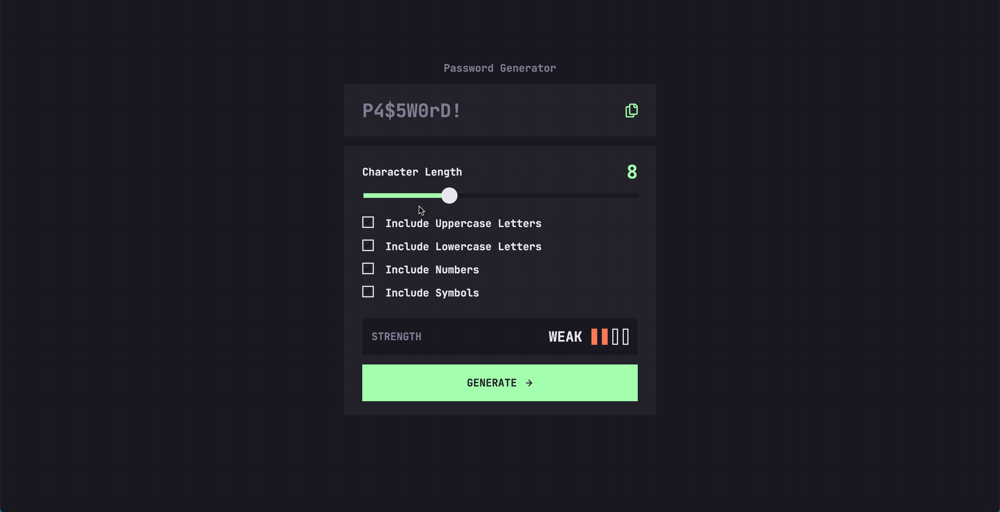

# Frontend Mentor - Password generator app solution

This is a solution to the [Password generator app challenge on Frontend Mentor](https://www.frontendmentor.io/challenges/password-generator-app-Mr8CLycqjh). Frontend Mentor challenges help you improve your coding skills by building realistic projects. 

Users should be able to:

- Generate a password based on the selected inclusion options
- Copy the generated password to the computer's clipboard
- See a strength rating for their generated password
- View the optimal layout for the interface depending on their device's screen size
- See hover and focus states for all interactive elements on the page

### Screenshot

### Built with

- Semantic HTML5 markup
- CSS custom properties
- Flex-box
- CSS Grid
- Mobile-first workflow

### What I learned

I learned how to personalize slider and improve my responsive  and JS skills.

### Continued development

JS

### Useful resources

- [https://www.w3schools.com] - Used it for some reminders about CSS and JS.
- [https://stackoverflow.com/] - Used it for some reminders, and problems that I have.
- [https://nikitahl.com/style-range-input-css] - It helps me for the range slider, how to fill before the thumb and update it.
- [https://openjavascript.info/2022/03/14/random-password-generator-using-javascript/] - Found this useful method with crypto.getRandomValues() instead of Math.random().

## Author

- GitHub - [@idowuojikutu](https://github.com/idowuojikutu)